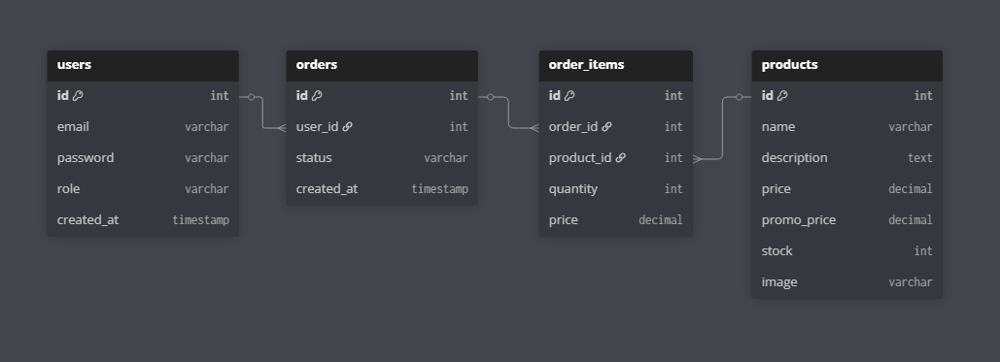
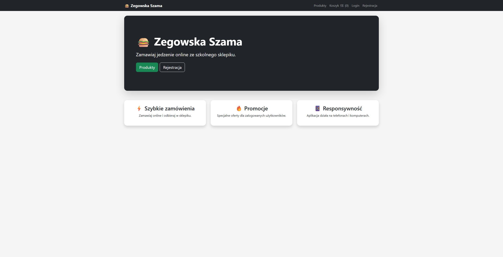
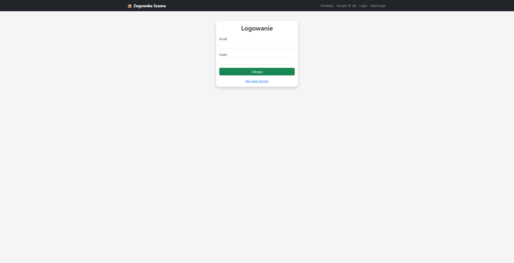
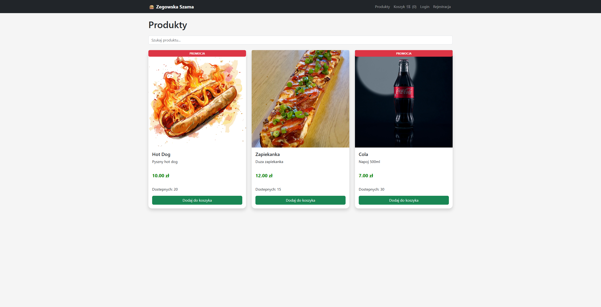
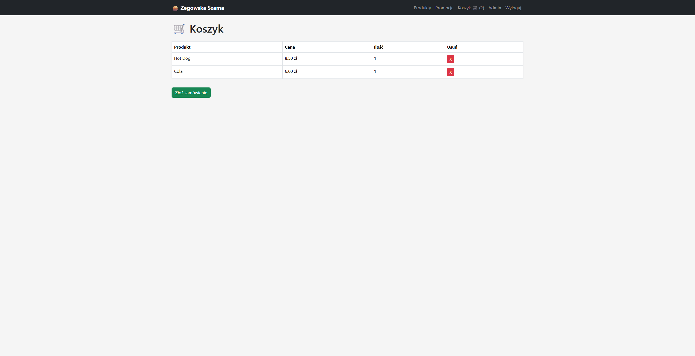
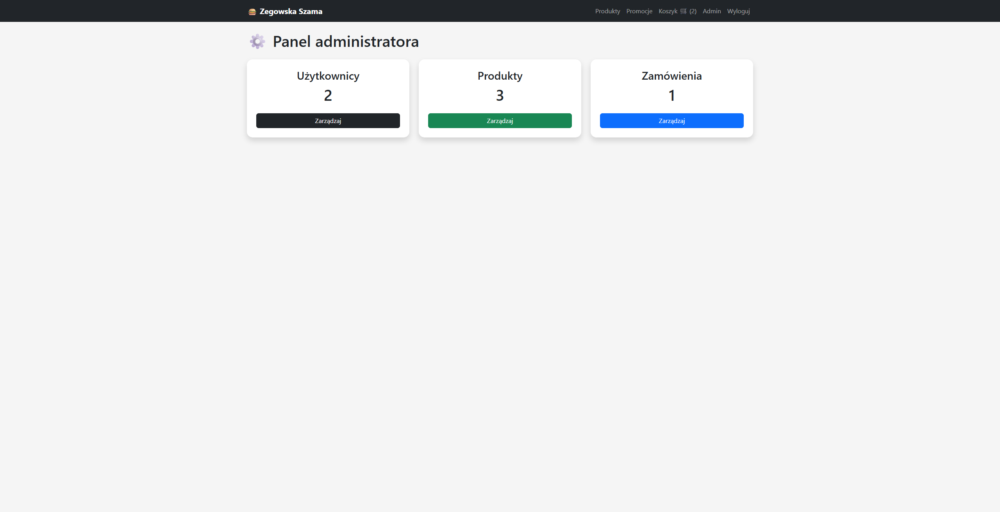

# 🍔 Zegowska Szama

## Nowoczesna aplikacja webowa dla szkolnego sklepiku

Projekt zespołowy wykonany w ramach przedmiotu **Zaawansowane aplikacje webowe**.

---

# 📌 Opis projektu

„Zegowska Szama” to responsywna aplikacja webowa umożliwiająca uczniom, nauczycielom oraz administratorom korzystanie z nowoczesnego systemu zamówień szkolnego sklepiku.

System pozwala na:

- rejestrację i logowanie użytkowników,
- przeglądanie produktów,
- korzystanie z promocji dostępnych dla zalogowanych użytkowników,
- składanie zamówień online,
- zarządzanie produktami, użytkownikami oraz zamówieniami przez administratora.

Aplikacja została wykonana z wykorzystaniem technologii backendowych i frontendowych zgodnych z wymaganiami projektu.

---

# 🛠️ Technologie

## Backend
- PHP 8

## Frontend
- HTML5
- CSS3
- JavaScript
- Bootstrap 5

## Baza danych
- MySQL

## Narzędzia
- Git
- GitHub
- XAMPP
- InfinityFree (hosting)

---

# ✨ Funkcjonalności

## 👤 System użytkowników

- rejestracja kont,
- logowanie i wylogowanie,
- hashowanie haseł (`password_hash()`),
- utrzymywanie sesji użytkownika,
- kontrola dostępu do widoków.

---

## 🛍️ Produkty i promocje

- pobieranie produktów z bazy danych,
- wyświetlanie nazw, cen oraz stanów magazynowych,
- wyszukiwanie produktów,
- promocje dostępne wyłącznie dla zalogowanych użytkowników,
- dynamiczne wyświetlanie cen promocyjnych.

---

## 🛒 Koszyk i zamówienia

- dodawanie produktów do koszyka,
- usuwanie produktów z koszyka,
- zapis koszyka w `localStorage`,
- składanie zamówień online,
- zapis zamówień do bazy danych,
- statusy zamówień.

---

## 🔐 Panel administratora

Administrator posiada możliwość:

- zarządzania użytkownikami,
- zmiany ról użytkowników,
- dodawania produktów,
- edycji produktów,
- usuwania produktów,
- zarządzania zamówieniami,
- zmiany statusów zamówień.

---

# 📱 Responsywność i UX

Aplikacja została wykonana w sposób responsywny z wykorzystaniem frameworka Bootstrap.

Interfejs został dostosowany do:
- komputerów,
- tabletów,
- smartfonów.

Dodatkowo zastosowano:
- responsywną siatkę Bootstrap,
- nowoczesne komunikaty typu Toast,
- intuicyjną nawigację,
- spójną kolorystykę,
- responsywne formularze i tabele.

---

# 🔒 Bezpieczeństwo

W projekcie zastosowano:

- hashowanie haseł,
- prepared statements zabezpieczające przed SQL Injection,
- kontrolę sesji administratora,
- walidację formularzy,
- ochronę widoków wymagających logowania.

---

# 🗄️ Struktura bazy danych

Projekt wykorzystuje relacyjną bazę danych MySQL.

## Główne tabele

- `users`
- `products`
- `orders`
- `order_items`

---

# 📊 Diagram ERD



**Rysunek 1.** Diagram ERD bazy danych aplikacji.

---

# 🖼️ Interfejs aplikacji

## Strona główna



**Rysunek 2.** Strona główna aplikacji.

---

## Logowanie



**Rysunek 3.** Formularz logowania użytkownika.

---

## Produkty



**Rysunek 4.** Lista produktów.

---

## Koszyk



**Rysunek 5.** Widok koszyka użytkownika.

---

## Panel administratora



**Rysunek 6.** Panel administratora.

---

# ⚙️ Instalacja lokalna

## Wymagania

- PHP 8+
- MySQL
- Apache / XAMPP
- przeglądarka internetowa

---

## Instrukcja instalacji

### 1. Sklonowanie repozytorium

```bash
git clone https://github.com/jexyq/zegowska-szama.git
```

---

### 2. Skopiowanie projektu do serwera lokalnego

Przenieś projekt do folderu:

```txt
htdocs/
```

---

### 3. Utworzenie bazy danych

Utwórz bazę danych MySQL, np.:

```txt
zegowska_szama
```

---

### 4. Import pliku SQL

Zaimportuj plik:

```txt
/sql/database.sql
```

do phpMyAdmin.

---

### 5. Konfiguracja połączenia z bazą danych

Edytuj plik:

```txt
includes/db.php
```

i ustaw własne dane połączenia.

---

### 6. Uruchomienie aplikacji

Otwórz w przeglądarce:

```txt
http://localhost/zegowska-szama
```

---

# ☁️ Wdrożenie online

Aplikacja została wdrożona na darmowym hostingu obsługującym PHP i MySQL.

Proces wdrożenia obejmował:
- konfigurację hostingu,
- import bazy danych,
- konfigurację FTP,
- upload plików aplikacji,
- konfigurację połączenia z bazą danych.

---

# 👥 Autorzy

Projekt wykonali:

- Szymon Jeż
- Szymon Fidor

---

# 📅 Czas realizacji

- rozpoczęcie projektu: **28.03.2026**
- zakończenie projektu: **17.05.2026**

---

# 🚀 Możliwości dalszego rozwoju

- integracja płatności online,
- system powiadomień e-mail,
- panel statystyk sprzedaży,
- aplikacja mobilna,
- system opinii użytkowników,
- integracja API.

---

# 📄 Licencja

Projekt został wykonany wyłącznie w celach edukacyjnych.
